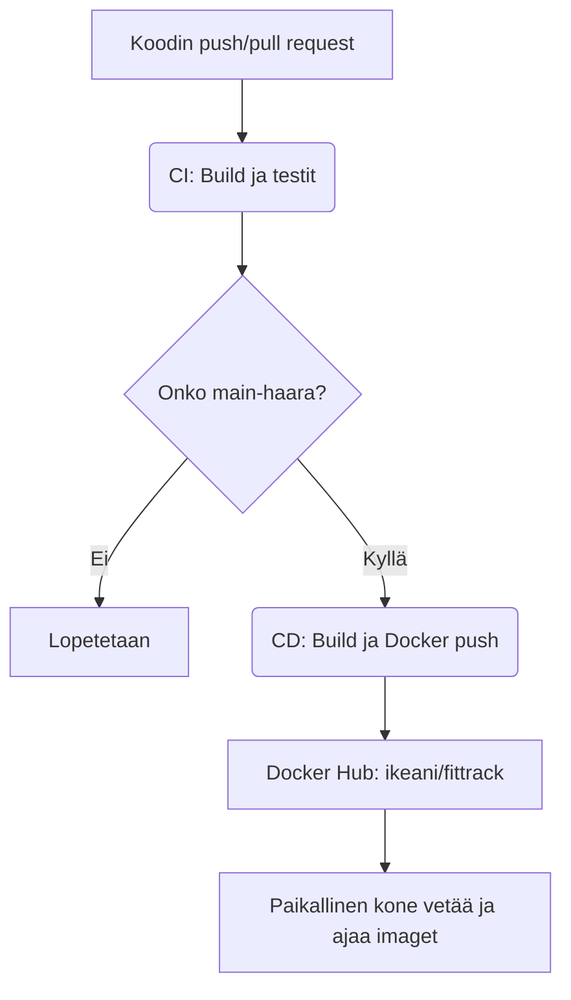

# Ohjelmistokehityksen teknologiat – Seminaarityö

## CI/CD Java Maven -projektille: FitTrack

**Tekijä:** Ike Aniebonam
**Päivämäärä:** 6.5.2025
**Projektivideo:** *(lisätään myöhemmin)*

---

## Sisältö

1. [Johdanto](#1-johdanto)
2. [Käytetyt teknologiat ja tekniikat](#2-käytetyt-teknologiat-ja-tekniikat)
3. [Työn vaiheet](#3-työn-vaiheet)
4. [CI/CD-arkkitehtuuri ja toiminta](#4-cicd-arkkitehtuuri-ja-toiminta)
5. [Johtopäätökset ja reflektointi](#5-johtopäätökset-ja-reflektointi)
6. [Lähteet](#6-lähteet)

---

## 1. Johdanto

Tässä seminaarityössä rakensin CI/CD-putken Java Maven -projektilleni nimeltä **FitTrack**. Seminaarityön tarkoituksena oli oppia, kuinka automatisoitu kehitys- ja julkaisuputki toimii oikean ohjelmiston yhteydessä. Sovellus on rakennettu Java 17 -versiolla ja se paketoitiin Docker-imageksi, joka julkaistiin Docker Hubiin GitHub Actionsin avulla.

CI (Continuous Integration) varmistaa, että jokainen muutos koodiin rakennetaan ja testataan automaattisesti. CD (Continuous Deployment) mahdollistaa uusien versioiden julkaisemisen automaattisesti. Näiden työkalujen hallinta on olennainen osa nykyaikaista DevOps-kehitystä.

Toteutus tehtiin paikallisesti, ilman pilvipalvelinta, mutta silti täysin automaattisella tavalla.

---

## 2. Käytetyt teknologiat ja tekniikat

### Teknologiat

* **Java 17** – ohjelmointikieli
* **Apache Maven** – rakennus- ja testityökalu
* **Docker** – sovelluksen kontittamiseen
* **Docker Hub** – konttikuvien jakeluun
* **GitHub Actions** – CI/CD-työnkulkujen automatisointiin

### Tekniikat

* Continuous Integration (CI)
* Continuous Deployment (CD)
* Dockerfile ja Docker-imaget
* Ympäristömuuttujat ja GitHub Secrets
* Paikallinen testaus ilman tuotantopalvelinta

---

## 3. Työn vaiheet

### 3.1 Projektin valmistelu

Projektina käytettiin aiemmin toteutettua Java Maven -sovellusta nimeltä FitTrack. Projektin rakenne tarkistettiin ja varmistettiin, että `mvn clean package` tuottaa .jar-tiedoston, joka voidaan paketoida Docker-kuvaksi.

### 3.2 GitHub-repositorion luominen

Projektin lähdekoodi versioitiin ja julkaistiin GitHub-repositorioon. Versionhallinnan avulla mahdollistettiin GitHub Actions -workflowiden ajaminen automaattisesti.

```bash
git init
git remote add origin <repository_url>
git add .
git commit -m "Initial commit"
git push -u origin main
```

### 3.3 CI – Build ja testaus

Continuous Integration (CI) tarkoittaa käytäntöä, jossa koodimuutokset integroidaan jatkuvasti pääprojektiin ja niiden toimivuus varmistetaan automaattisesti. Tässä projektissa CI toteutettiin GitHub Actionsin avulla, luomalla tiedosto `.github/workflows/ci.yml`.

CI käynnistyy automaattisesti aina, kun koodia pusketaan `main`-haaraan tai kun tehdään pull request siihen. Workflow tarkistaa, että projektin rakenne on kunnossa, koodi kääntyy virheettömästi ja yksikkötestit menevät läpi.

CI-workflow sisältää seuraavat vaiheet:

* **Koodin hakeminen**: GitHub hakee projektin viimeisimmän version build-agentille
* **JDK 17\:n asennus**: Java-projektin kääntämistä varten käytetään OpenJDK 17 -ympäristöä
* **Projektin kääntäminen**: Mavenin `mvn clean package` luo `.jar`-tiedoston
* **Testien suoritus**: `mvn test` ajaa kaikki testit ja palauttaa onnistumisstatuksen

Tämän automatisoinnin ansiosta kehittäjät saavat heti palautteen siitä, rikkooko koodimuutos mitään olemassa olevaa toiminnallisuutta. CI vähentää manuaalista testaustyötä ja estää virheiden päätymistä päähaaraan.

CI\:n käyttöönoton aikana opin myös virheiden tulkintaa: esimerkiksi puuttuvat riippuvuudet, väärät tiedostopolut tai virheellisesti nimetyt `.jar`-tiedostot aiheuttivat build-epäonnistumisia, jotka näkyvät GitHub Actions -lokeissa selkeästi. Näiden avulla oli helppo paikantaa ongelma ja korjata se.

```bash
Run mvn clean package
[INFO] Scanning for projects...
[INFO] Building FitTrack 0.0.1-SNAPSHOT
[INFO] Total time: 2.5 s
[INFO] BUILD SUCCESS

Run mvn test
[INFO] Running AppTest
[INFO] Tests run: 5, Failures: 0, Errors: 0, Skipped: 0
[INFO] BUILD SUCCESS
```

CI on ohjelmistokehityksessä kriittinen vaihe: se pitää projektin teknisesti kunnossa ja mahdollistaa jatkuvan kehityksen ilman pelkoa regressioista.

### 3.4 CD – Docker-kuva ja julkaisu

Continuous Deployment (CD) tarkoittaa automaattista ohjelmiston julkaisemista, kun koodi on ensin läpäissyt CI-vaiheen. Tässä projektissa CD toteutettiin omalla workflow-tiedostolla `.github/workflows/cd.yml`, joka aktivoituu aina kun koodia pusketaan `main`-haaraan.

CD-putken tarkoituksena on:

* Rakentaa valmis `.jar` Mavenilla
* Paketoida se Docker-kuvaksi `Dockerfile`-tiedoston ohjeiden mukaisesti
* Kirjautua Docker Hubiin GitHub Secretsien avulla
* Puskea kuva tunnuksella `ikeani/fittrack:latest` Docker Hubiin

CD mahdollistaa automaattisen ja yhdenmukaisen julkaisemisen. Jokainen uusi koodiversio päätyy automaattisesti Docker Hubiin ilman manuaalisia komentoja.

CD\:n vaiheissa opin muun muassa:

* Kuinka Dockerfile viittaa oikeaan tiedostonimeen, ja miksi `.jar`-tiedoston nimi pitää tietää etukäteen
* Miten `docker build` lukee kontekstin, ja kuinka väärä kansiorakenne voi rikkoa kuvan
* Miten GitHubin `secrets`-ominaisuudella voi turvallisesti tallentaa Docker-tunnukset ilman, että ne näkyvät julkisesti

```bash
docker build -t ikeani/fittrack:latest .
Sending build context to Docker daemon  18.3MB
Step 1/3 : FROM openjdk:17-jdk-slim
 ---> 1d47c76ce852
Step 2/3 : COPY target/fittrack-0.0.1-SNAPSHOT.jar app.jar
 ---> Using cache
 ---> 6c0a3e789bed
Step 3/3 : ENTRYPOINT ["java", "-jar", "/app.jar"]
 ---> Running in e8927fe9a123
Successfully built e2fa6d23c4a1
Successfully tagged ikeani/fittrack:latest

docker push ikeani/fittrack:latest
Pushed ikeani/fittrack:latest to Docker Hub
```

CD-toiminnallisuus mahdollisti sen, että julkaisin projektin valmiin version yhdellä pushilla — ilman komentorivityötä. Tämä tekee ohjelmiston elinkaaren hallinnasta huomattavasti tehokkaampaa ja luotettavampaa.

---

## 4. CI/CD-arkkitehtuuri ja toiminta

### 🔧 CI/CD-mermaid-kaavio

Alla oleva kaavio kuvaa koko CI/CD-prosessin etenemisen: kuinka koodimuutos kulkee buildista julkaisuun Docker Hubiin ja edelleen paikalliselle koneelle testattavaksi.



Tämä rakenne mahdollistaa jatkuvan kehityksen, automaattisen testauksen ja julkaisemisen ilman ylimääräistä manuaalista vaivaa. Se on yksinkertainen, tehokas ja soveltuu hyvin myös laajempiin projekteihin.